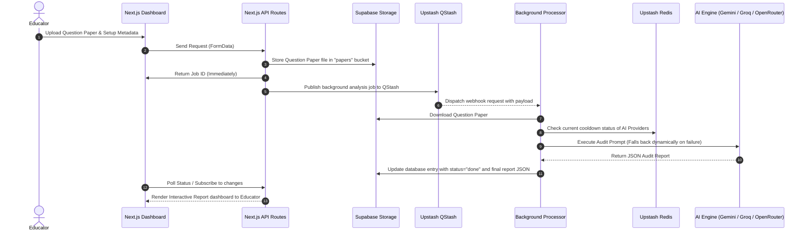

# AI-Assisted Question Paper Error Detector 🔍📄

A robust, enterprise-grade Next.js application designed to audit educational question papers automatically using Google Gemini and Llama. It identifies critical errors in language, structure, mark allocation, syllabus coverage, and logical formatting, generating detailed, interactive reports to ensure exam quality before printing.

---

## 🛠️ Tech Stack

This project is built using a modern, scalable, and resilient stack:

| Layer | Technology | Purpose |
| :--- | :--- | :--- |
| **Framework** | [Next.js 16 (App Router)](https://nextjs.org/) | Core full-stack framework with React 19 server-side rendering and API routes |
| **Styling** | [Tailwind CSS v4](https://tailwindcss.com/) | Advanced, modern styling and fully responsive layouts |
| **Database** | [Supabase (PostgreSQL)](https://supabase.com/) | User authentication, persistent audit logs, and transaction storage |
| **Object Storage** | [Supabase Storage](https://supabase.com/) | Secure document storage for question papers, syllabi, and patterns |
| **Background Processing** | [Upstash QStash](https://upstash.com/qstash) | Serverless message queue to handle long-running LLM processing jobs asynchronously |
| **Cache & State** | [Upstash Redis](https://upstash.com/redis) | Caching and provider cooldown management to mitigate rate-limiting and service outages |
| **AI Orchestration** | [Google Gemini API](https://ai.google.dev/) (Primary) | Primary multi-modal analysis using `gemini-2.5-flash-lite` |
| **AI Fallbacks** | [Groq API](https://groq.com/) & [OpenRouter](https://openrouter.ai/) | Secondary and tertiary text fallbacks using Llama 4 Scout (17B) |
| **Document Parsing** | [Mammoth.js](https://github.com/mrousavy/mammoth.js) | Server-side parsing of Word documents (`.docx`) to clean Markdown |

---

## 🏗️ Architecture & Processing Flow

The system employs a queue-based, decoupled background processing flow to ensure reliability even during network spikes or high LLM response latencies:



### 🛡️ Smart Failover & Cooldown Architecture
LLM APIs can experience rate limits or transient downtimes. To guarantee high availability, the worker implements a sequential fallback chain:
1. **Gemini 2.5 Flash Lite** (Primary - Handles PDFs, images, and text).
2. **Llama 4 Scout via Groq** (Secondary fallback - Text-only).
3. **Llama 4 Scout via OpenRouter** (Tertiary fallback - Text-only).

If an API encounters a transient server error or a rate limit (HTTP 429), it sets a dynamic cooldown period in **Upstash Redis**. Subsequent jobs skip the cooldown-locked provider automatically, preventing duplicate failures and minimizing total processing time.

---

## ✨ Features

- **Multi-Format File Ingestion:** Upload and audit question papers as PDFs, images (PNG/JPG), or Word Documents (`.docx`).
- **Context-Aware Auditing:**
  - **Syllabus Verification:** Check if questions test topics that are out of bounds or not mentioned in the official syllabus.
  - **Exam Pattern Checks:** Ensure formatting matches the target layout schema.
  - **Stated Marks Reconciliation:** Cross-references question points with the stated total marks.
- **Granular Error Breakdown:**
  - **Language & Grammar:** Spelling mistakes, broken sentences, or ambiguous wording.
  - **Structure & Formatting:** Missing instructions, bad numbering, inconsistent sub-parts.
  - **Marks Allocation:** Incorrect totals, missing weights, contradictory guidelines.
  - **Syllabus Alignment:** Off-topic questions.
  - **Logical Inconsistencies:** Questions with no correct answers, missing referenced graphs/charts, or impossible figures.
- **Educator Dashboard:** 
  - Visual health score (0-100) and clear action verdicts (Ready to Print vs. Needs Revision).
  - Categorized list of priority fixes sorted by severity (Critical vs. Warning vs. Suggestion).
  - List of verified "Clean Questions" that can be greenlit immediately.
  - PDF/Print-friendly summary reports.
- **Audit History:** Look up previous runs and track status (Pending, Processing, Done, Failed) at any time.

---

## 🚀 Getting Started

### 📋 Prerequisites
- Node.js (v18.x or later)
- NPM or PNPM
- A Supabase Project
- An Upstash Redis & QStash account
- API keys for Google Gemini, Groq, and/or OpenRouter

### 🔑 Environment Variables
Create a `.env.local` file in the root directory and populate it with the following keys:

```bash
# App Deployment URL (used for QStash webhook callbacks in production)
NEXT_PUBLIC_APP_URL=http://localhost:3000

# Google Gemini API
GEMINI_API_KEY=your_gemini_api_key

# Supabase Configurations
NEXT_PUBLIC_SUPABASE_URL=https://your-project.supabase.co
NEXT_PUBLIC_SUPABASE_ANON_KEY=your_anon_key
SUPABASE_SERVICE_ROLE_KEY=your_service_role_key # Used for backend admin queries

# Upstash Redis (Provider Cooldowns & Caching)
UPSTASH_REDIS_REST_URL=https://your-db.upstash.io
UPSTASH_REDIS_REST_TOKEN=your_redis_token

# Upstash QStash (Serverless Queueing)
QSTASH_TOKEN=your_qstash_token
QSTASH_CURRENT_SIGNING_KEY=your_qstash_signing_key
QSTASH_NEXT_SIGNING_KEY=your_qstash_next_signing_key

# Fallback AI Engines
GROQ_API_KEY=your_groq_key
OPENROUTER_API_KEY=your_openrouter_key
```

### 🗄️ Database Setup
Run the following SQL script in your Supabase SQL Editor to set up the required table schema:

```sql
-- Create the analyses table
create table public.analyses (
  id uuid default gen_random_uuid() primary key,
  user_id uuid references auth.users not null,
  status text not null default 'pending', -- 'pending', 'processing', 'done', 'failed'
  file_path text not null,
  file_name text not null,
  total_marks numeric not null,
  report jsonb not null default '{}'::jsonb,
  created_at timestamp with time zone default timezone('utc'::text, now()) not null
);

-- Enable RLS (Row Level Security)
alter table public.analyses enable row level security;

-- Policies
create policy "Users can view their own analyses" 
  on public.analyses for select 
  using (auth.uid() = user_id);

create policy "Users can insert their own analyses" 
  on public.analyses for insert 
  with check (auth.uid() = user_id);

create policy "Users can delete their own analyses" 
  on public.analyses for delete 
  using (auth.uid() = user_id);

-- Storage Setup
-- Note: Create a public or private bucket named "papers" in Supabase Storage 
-- and configure corresponding access policies allowing authenticated users to upload/download.
```

### 💻 Installation & Local Development
1. Clone the repository:
   ```bash
   git clone https://github.com/abhinavsudhik/AI-assisted-Question-Paper-Error-Detector.git
   cd AI-assisted-Question-Paper-Error-Detector
   ```
2. Install dependencies:
   ```bash
   npm install
   # or
   pnpm install
   ```
3. Run the development server:
   ```bash
   npm run dev
   ```
4. Open [http://localhost:3000](http://localhost:3000) in your browser.

> **Note on Local Development:** If `QSTASH_TOKEN` or `NEXT_PUBLIC_APP_URL` are not configured (or point to `localhost`), the system automatically bypasses the remote QStash queue and processes jobs asynchronously in the local Node.js process using background Promise handlers.

---

## 📈 Auditing Guidelines
The underlying AI models are instructed to act as a **strict but fair** auditor using the following rulebook:
- **Language Errors:** Flagged only if they change technical meaning or would genuinely confuse a student (e.g., spelling errors like *"explian"* or grammatically broken questions). Stylistic choices are ignored.
- **Formatting & Layout:** Flagged for inconsistent labeling (e.g. mixing `a/b/c` with `i/ii/iii`), duplicate question numbering, or missing instructions.
- **Marks Inconsistencies:** Checked for sum correctness, missing allocation on sub-sections, and contradiction in instructions.
- **Syllabus Check:** Highlights questions testing topics outside the uploaded syllabus guidelines.
- **Logical Feasibility:** Flags questions with missing tables/diagram references, impossible values/dates, or multiple conflicting answers.
